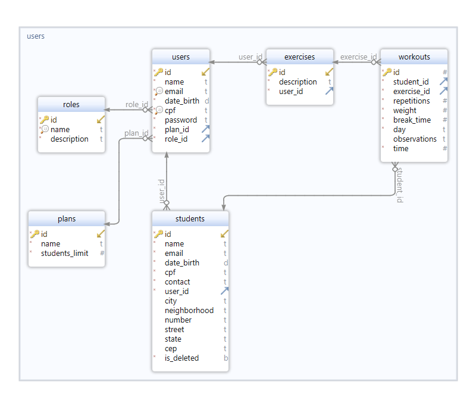

# TrainSys

## Introduction
Complete Rest API dedicated to gym instructors to improve the administration of their students' training

## Problem Solved

The application addresses the challenges of managing and tracking workout routines for students. It allows trainers to create personalized workout plans, monitor student progress, and adjust routines based on performance metrics.

## Technologies Used

- [**Java**](https://www.java.com/en/download/help/whatis_java.html): Core programming language.
- [**Spring Boot**](https://spring.io/): Framework for building the application.
- [**Maven**](https://maven.apache.org/): Build automation tool.
- [**JWT**](https://jwt.io/): JSON Web Tokens for authentication.
- [**PostgreSQL**](https://www.postgresql.org/): Database for storing application data.
- [**Docker**](https://www.docker.com/): Docker compose to containerize the application.
- [**Git**](https://git-scm.com/): Handle version control.

## Tools Used

- [**IntelliJ IDEA**](https://www.jetbrains.com/idea/): IDE for development.
- [**Postman**](https://www.postman.com/): API testing.
- [**Trello**](https://trello.com/): Manage and organize the project.

## Useful Resources
- [**Trello Dashboard**](https://trello.com/b/sNYpRk7M/trainsys)

## Project Structure
````
TrainSys
├── db
│   └── schema
├── src
│   ├── main
│   │   ├── java
│   │   │   └── com
│   │   │       └── trainsys
│   │   │           └── trainsys_application
│   │   │               ├── config
│   │   │                   ├── database
│   │   │                   └── security
│   │   │               ├── controller
│   │   │               ├── dto
│   │   │               ├── entity
│   │   │               ├── exception
│   │   │               ├── repository
│   │   │               ├── response
│   │   │               └── service
│   │   │                   └── impl
│   │   └── resources
│   │       └── application.properties
│   └── test
│       └── java
│           └── com
│               └── trainsys
│                   └── trainsys_application
├── .gitignore 
├── docker-compose.yml
├── pom.xml
└── README.md
````

## Application Routes

### Authentication
- **POST /auth/signup**: Register a new user.
   - Request Body:
     ```json
     {
       "email": "string",
       "password": "string",
       "name": "string",
       "dateBirth": "yyyy-MM-dd",
       "cpf": "string",
       "plan": "string"
     }
     ```
   - Response Body (200 OK):
     ```json
     {
       "name": "string",
       "email": "string",
       "dateBirth": "yyyy-MM-dd",
       "cpf": "string",
       "planName": "string",
       "roleDescription": "string"
     }
     ```
- **POST /auth/login**: Authenticate a user and return a token.
   - Request Body:
     ```json
     {
       "email": "string",
       "password": "string"
     }
     ```
   - Response Body (200 OK):
     ```json
     {
       "token": "string",
       "expiresIn": "integer (hours)",
       "name": "string"
     }
     ```

### Dashboard
- **GET /dashboard**: Get a dashboard with user's info.
   - Response Body (200 OK):
     ```json
     {
       "registeredStudents": "integer",
       "registeredExercises": "integer",
       "currentUserPlan": "string",
       "remainingStudents": "integer"
     }
     ```

### Exercise
- **POST /exercises**: Create a new exercise.
   - Request Body:
     ```json
     {
       "description": "string"
     }
     ```
   - Response Body (201 Created):
     ```json
     {
       "id": "long",
       "description": "string"
     }
     ```
- **GET /exercises**: Get a list of all exercises.
    - Response Body (200 OK):
     ```json
     [
     {
       "id": 1,
       "description": "Exercise 1 description"
     },
     {
       "id": 2,
       "description": "Exercise 2 description"
     },
     {
       "id": 3,
       "description": "Exercise 3 description"
     }
     ]
     ```

- **DELETE /exercises/{id}**: Delete an exercise.
    - Response Body (204 NO_CONTENT)

### Students
- **POST /students**: Register a new student.
   - Request Body:
     ```json
     {
       "name": "string",
       "email": "string",
       "dateBirth": "yyyy-MM-dd",
       "cpf": "string",
       "contact": "string",
       "cep": "string",
       "street": "string",
       "state": "string",
       "neighborhood": "string",
       "city": "string",
       "number": "string"
     }
     ```
   - Response Body (201 Created):
     ```json
     {
       "id": "long",
       "name": "string",
       "email": "string",
       "dateBirth": "yyyy-MM-dd",
       "cpf": "string",
       "contact": "string",
       "address": {
         "cep": "string",
         "street": "string",
         "state": "string",
         "neighborhood": "string",
         "city": "string",
         "number": "string"
       }
     }
     ```
- **GET /students**: Get a list of all students.
   - Response Body (200 OK):
     ```json
     [
     {
       "id": 1,
       "name": "Student 1",
       "email": "student1@example.com",
       "dateBirth": "2000-01-01",
       "cpf": "123.456.789-00",
       "contact": "123456789",
       "address": {
         "cep": "12345-678",
         "street": "Example Street",
         "state": "Example State",
         "neighborhood": "Example Neighborhood",
         "city": "Example City",
         "number": "123"
       }
     },
     {
       "id": 2,
       "name": "Student 2",
       "email": "student2@example.com",
       "dateBirth": "1995-05-05",
       "cpf": "987.654.321-00",
       "contact": "987654321",
       "address": {
         "cep": "54321-876",
         "street": "Another Street",
         "state": "Another State",
         "neighborhood": "Another Neighborhood",
         "city": "Another City",
         "number": "456"
       }
     }
     ]
     ```

- **DELETE /students/{id}**: Delete a student.
    - Response Body (204 NO_CONTENT)


- **PUT /students/{id}**: Update student information.
   - Request Body:
     ```json
     {
       "name": "string",
       "email": "string",
       "dateBirth": "yyyy-MM-dd",
       "cpf": "string",
       "contact": "string",
       "cep": "string",
       "street": "string",
       "state": "string",
       "neighborhood": "string",
       "city": "string",
       "number": "string"
     }
     ```
   - Response Body (200 OK):
     ```json
     {
       "id": "long",
       "name": "string",
       "email": "string",
       "dateBirth": "yyyy-MM-dd",
       "cpf": "string",
       "contact": "string",
       "address": {
         "cep": "string",
         "street": "string",
         "state": "string",
         "neighborhood": "string",
         "city": "string",
         "number": "string"
       }
     }
     ```
- **GET /students/{id}/workouts**: Get workouts associated with a student.
    - Response Body (200 OK):
     ```json
     {
       "studentId": 1,
       "studentName": "Alice Johnson",
       "workouts": {
         "MONDAY": [
           {
             "id": 1,
             "studentId": 1,
             "exerciseId": 1,
             "repetitions": 15,
             "weight": 0.0,
             "breakTime": 30,
             "day": "MONDAY",
             "observations": "No issues",
             "time": 10
           }
         ],
         "TUESDAY": [],
         "WEDNESDAY": [
           {
             "id": 3,
             "studentId": 1,
             "exerciseId": 1,
             "repetitions": 10,
             "weight": 20.5,
             "breakTime": 30,
             "day": "WEDNESDAY",
             "observations": "Work hard!",
             "time": 10
           }
         ],
         "THURSDAY": [],
         "FRIDAY": [],
         "SATURDAY": [],
         "SUNDAY": []
       }
     }
     ```

- **GET /students/{id}**: Get details of a specific student.
    - Response Body (200 OK):
      ```json
      {
        "id": 1,
        "name": "Student 1",
        "email": "student1@example.com",
        "dateBirth": "2000-01-01",
        "cpf": "123.456.789-00",
        "contact": "123456789",
        "address": {
          "cep": "12345-678",
          "street": "Example Street",
          "state": "Example State",
          "neighborhood": "Example Neighborhood",
          "city": "Example City",
          "number": "123"
        }
      }
      ```

### Workouts
- **POST /workouts**: Register a new workout.
   - Request Body:
     ```json
     {
       "studentId": "long",
       "exerciseId": "long",
       "repetitions": "integer",
       "weight": "double",
       "breakTime": "integer",
       "day": "string",
       "observations": "string",
       "time": "integer"
     }
     ```
   - Response Body (201 Created):
     ```json
     {
       "id": "long",
       "studentId": "long",
       "exerciseId": "long",
       "repetitions": "integer",
       "weight": "double",
       "breakTime": "integer",
       "day": "string",
       "observations": "string",
       "time": "integer"
     }
     ```

### Users
- **GET /users/me**: Get information about the authenticated user.
    - Response Body (200 OK):
      ```json
      {
        "id": 1,
        "name": "John Doe",
        "email": "john.doe@example.com",
        "dateBirth": "1980-01-01",
        "cpf": "123.456.789-00",
        "password": "encrypted password",
        "plan": {
          "id": 1,
          "name": "Plan Name",
          "studentsLimit": 15
        },
        "role": {
          "id": 1,
          "name": "ROLE",
          "description": "Type description"
        },
        "enabled": true,
        "username": "john.doe@example.com",
        "authorities": [],
        "accountNonLocked": true,
        "accountNonExpired": true,
        "credentialsNonExpired": true
      }
      ```
      
- **GET /users**: Get a list of all users.
    - Response Body (200 OK):
      ```json
      [
      {
        "id": 1,
        "name": "John Doe",
        "email": "john.doe@example.com",
        "dateBirth": "1980-01-01",
        "cpf": "123.456.789-00",
        "password": "encrypted password",
        "plan": {
          "id": 1,
          "name": "Plan Name",
          "studentsLimit": 15
        },
        "role": {
          "id": 1,
          "name": "ROLE",
          "description": "Type description"
        },
        "enabled": true,
        "username": "john.doe@example.com",
        "authorities": [],
        "accountNonLocked": true,
        "accountNonExpired": true,
        "credentialsNonExpired": true
      },
      {
        "id": 2,
        "name": "Jane Smith",
        "email": "jane.smith@example.com",
        "dateBirth": "1990-02-02",
        "cpf": "987.654.321-00",
        "password": "encrypted password",
        "plan": {
          "id": 2,
          "name": "Plan Name",
          "studentsLimit": 30
        },
        "role": {
          "id": 1,
          "name": "ROLE",
          "description": "Type description"
        },
        "enabled": true,
        "username": "jane.smith@example.com",
        "authorities": [],
        "accountNonLocked": true,
        "accountNonExpired": true,
        "credentialsNonExpired": true
      }
      ]
      ```

## Database Diagram



## Prerequisites

- JDK 22 or above
- Git
- Docker

## Installation

To run the project locally, follow these steps:

1. **Clone the repository:**
   ```sh
   git clone https://github.com/Trisotto/TrainSys.git
   cd TrainSys

2. **Build the project:**
   ```sh
   mvn clean install

3. **Run the application:**
   ```sh
   mvn spring-boot:run

Or open in your IDE and play with it.

## Usage

Once the application is running, you can access the API and test the endpoints using any tool(like Postman or Insomnia) at:
   ```sh
   http://localhost:8005/
   ```

## Possible Improvements

- **Enhanced User Interface**: Develop a front-end application using React or Angular.
- **Notifications**: Implement email or SMS notifications for workout updates.
- **Advanced Analytics**: Integrate analytics to provide insights on student performance and progress.
- **Mobile Application**: Develop a mobile app for easier access and management on the go.
- **Role Validation**: Implement role-based access control to ensure that only authorized users can access certain features.

## License

This project is licensed under the MIT License. See the [LICENSE](LICENSE) file for details.